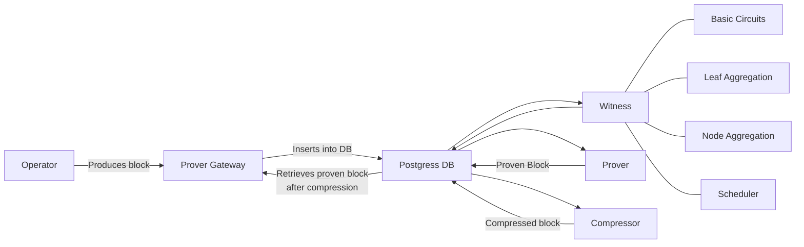

# zkSync stack 



The `zkSync` stack covers a set of tools designed to facilitate the interaction with the complete development cycle on the zkSync Layer-2 blockchain.

The stack consists of:
- [Dockerized L1 node and a zkSync L2 node](https://github.com/matter-labs/zksync-era)
- [Block explorer](https://github.com/matter-labs/block-explorer#%EF%B8%8F-setting-up-env-variables)
- A Prometheus + Grafana setup for observability.
- [Prover with CPU and GPU support](https://github.com/matter-labs/zksync-era/tree/main/prover)

## Starting the stack

**Please note that Docker and Docker-Compose are required to run the following commands.**

To get started, we need to install all the essential dependencies. You can achieve this by running the following command:

```bash
make deps
```

This command not only installs the necessary dependencies for running all the tools in the stack but also downloads the binaries for the `zksolc` and `solc` compilers. These compilers are crucial for executing some of the examples provided in the subsequent sections.

Once all the dependencies are successfully installed, you can initiate the entire stack with a single command:

```bash
make run
```

This will launch all the components of the ZKSync full stack except the prover, allowing you to dive into the development environment quickly.

To run it with the CPU prover as well, run

```bash
make run PROVER=cpu
```

instead. See the requirements section below to check if you meet the requirements to run in prover mode.

## Requirements

### CPU Prover Setup

- A CPU with at least 8 physical cores.
- 50 GB of RAM.
- 400 GB of free disk space.

### GPU Prover Setup

- A CPU with at least 8 physical cores.
- 16 GB of RAM.
- 30 GB of free disk space.
- An Nvidia L4/T4 GPU with 16GB of RAM

The non-prover should run on any decent modern machine.

## Local Nodes

The mentioned command facilitates the creation of essential Docker containers for your development environment. This includes setting up a `PostgreSQL` database and the L1 local Geth node. Moreover, it compiles and deploys all the necessary contracts for the L2 local node to function. Please note that this process may take a moment to complete.

In this context, it's essential to mention that many of the tools used will take control of the terminal. Therefore, we've installed `tmux` in the previous step to manage different commands and sessions for each tool. For the L2 node, the session is named `zksync-server`. To view the logs and observe the server in action, you can use the following command: `tmux a -t zksync-server`.

The L1 Geth node runs at `http://localhost:8545`, while the L2 node is available at `http://localhost:3050`.

## Block Explorer

The development environment includes a block explorer to inspect transactions and proofs within the nodes. This explorer runs within a `tmux` session named `zksync-explorer`. You can view it by executing the following command: `tmux a -t zksync-explorer`. To access the explorer in your web browser, navigate to `http://localhost:3010`.

Additionally, you can access the API at `http:localhost/3020` and the worker at `http://localhost:3001`.

## Grafana and Observability

Other Docker containers are running Grafana and Prometheus, tools for monitoring and creating dashboards. To access a helpful dashboard that provides information about every transaction executed by the node, open your web browser and visit `http://localhost:3000`. Once in that page, click on the hamburger menu on the top left of the screen, on the menu that will slide on, head on over to "Dashboards" to see the available dashboards. You can also use the python script `automate_transactions.py` to generate data.

## Prover

When the stack is initiated in prover mode, various binaries execute, each containing one of the tools involved in the process of block proof generation. Here's a list of all the binaries and different components being executed, along with their corresponding `tmux` session since all these components take control of the terminal:

- **Prover**: The main prover. The `tmux` session for this part is `zksync-prover`.
- **Prover gateway**: Acts as a communication layer between the server running the state keeper and the proving subsystem. The `tmux` session for this part is `zksync-prover-gateway`.
- **Witness generator**: Responsible for creating prover jobs. The `tmux` session for this part is `zksync-witness-generator`.
- **Proof compressor**: The final step that compresses/wraps the FRI proof into a SNARK. The `tmux` session for this part is `zksync-block-compressor`.

## Deployment and Contract Interaction

To begin testing the local nodes and interacting with them, this repository offers a basic `ERC20` contract for your use.

To deploy the contract and call its functions, start by cloning the [zksync-era-cli](https://github.com/lambdaclass/zksync_era_cli) tool repository. This tool provides a range of useful commands, but for this example, you'll primarily use `deploy`, `call` and `send` commands.

In all the following examples, we'll rely on a specific private key: `0x27593fea79697e947890ecbecce7901b0008345e5d7259710d0dd5e500d040be`. This key belongs to one of the rich wallets deployed in the local node for testing purposes. The address derived from this private key is `0xde03a0b5963f75f1c8485b355ff6d30f3093bde7`, we use it as argument for the constructor to initialize with a certain number of tokens. 

Once the node is up and running, use the following command to deploy our `ERC20` contract, a standard token:

```bash
zksync-era-cli --l2-port 3050 deploy \
--project-root contracts/ \
--contract contracts/ERC20.sol \
--contract-name ERC20 \
--constructor-args 0xde03a0b5963f75f1c8485b355ff6d30f3093bde7 \
--private-key 0x27593fea79697e947890ecbecce7901b0008345e5d7259710d0dd5e500d040be \
--chain-id 270
```

If the deployment is successful, you'll receive the transaction receipt and an output similar to this:

```
INFO: `0x...`
```

This address represents where the contract is now deployed. After deploying the contract, you can interact with it in various ways. For instance, you can retrieve the name of the deployed token by calling the following function:

```bash
zksync-era-cli --l2-port 3050 call \
--contract <address> \
--function "name()" \
--output-types string \
--chain-id 270
```

Where the `address` corresponds to the address of the deployed `ERC20` contract.
The output will look like this:

```
INFO: String(`lambdacoin`)
```

This is the initial name of your token. Additionally, you can examine the initial balance of the address you passed as an argument for deployment using the `constructor-args` flag. To check the initial balance, execute the following command:

```bash
zksync-era-cli --l2-port 3050 call \
--contract <address> \
--function "balanceOf(address)" \
--args "0xde03a0b5963f75f1c8485b355ff6d30f3093bde7" \
--output-types uint256 \
--chain-id 270
```

The output will look like this:

```
INFO: UINT256(1000000)
```

This indicates the initial balavnce of the specified address: 1,000,000 tokens.

There's another function to transfer some of the tokens to another address, in order to do that we will send a transaction calling that function.

```bash
zksync-era-cli --l2-port 3050 send \
--contract <address> \
--function "transfer(address, uint256)" \
--args <to_address> 200 \
--output-types bool \
--private-key 0x27593fea79697e947890ecbecce7901b0008345e5d7259710d0dd5e500d040be \
--chain-id 270
```

Where the `to_address` would be the receiver address.
The output should look like the following:

```
INFO: `0x...`
```

Representing the hash of the executed transaction.

## Validium Mode

Disclaimer: this feature is still in early development, expect bugs and missing features.

The stack can be run in `Validium mode`. In this mode, data availability is pushed to the L2, which means state diffs are not stored on the L1 anymore. To run the stack in validium mode, pass the `VALIDIUM` flag as `true` to the `deps` target, like so:

```bash
make deps VALIDIUM=true
```

You can find more info on validium mode [here](https://github.com/matter-labs/zksync-era/pull/459).
