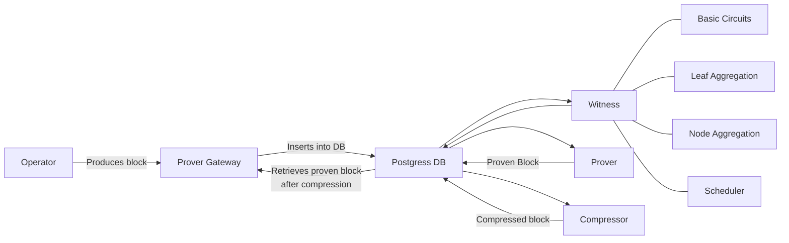

# zkSync full stack 



ZKSync full stack covers a set of tools designed facilitate the interaction with the complete development cycle in the zkSync Layer-2 blockchain.

The stack mainly consist of:
- [L1 node inside Docker and L2 node](https://github.com/matter-labs/zksync-era)
- [Block explorer](https://github.com/matter-labs/block-explorer#%EF%B8%8F-setting-up-env-variables)
- Grafana and observavility tools
- Verifier with CPU and GPU support

## Starting the stack

**Please note that Docker is required to run the following commands.**

To get started, we need to install all the essential dependencies. You can achieve this by running the following command:

```bash
make deps
```

This command not only installs the necessary dependencies for running all the tools in the stack but also downloads the binaries for the `zksolc` and `solc` compilers. These compilers are crucial for executing some of the examples provided in the subsequent sections.

Once all the dependencies are successfully installed, you can initiate the entire stack with a single command:

```bash
make run
```

This command will launch all the components of the ZKSync full stack, allowing you to dive into the development environment quickly.

## Local Nodes

The mentioned command facilitates the creation of essential Docker containers for your development environment. This includes setting up a PostgreSQL database and the L1 local Geth node. Moreover, it compiles and deploys all the necessary contracts for the L2 local node to function. Please note that this process may take a moment to complete.

In this context, it's essential to mention that many of the tools used will take control of the terminal. Therefore, we've installed `tmux` in the previous step to manage different commands and sessions for each tool. For the L2 node, the session is named `zksync-server`. To view the logs and observe the server in action, you can use the following command: `tmux a -t zksync-server`.

The L1 Geth node runs at `http://localhost:8545`, while the L2 node is available at `http://localhost:3050`.

## Block Explorer

The development environment includes a block explorer to inspect transactions and proofs within the nodes. This explorer runs within a `tmux` session named `zksync-explorer`. You can view it by executing the following command: `tmux a -t zksync-explorer`. To access the explorer in your web browser, navigate to `http://localhost:3010`.

Additionally, you can access the API at `http:localhost/3020` and the worker at `http://localhost:3001`.

## Grafana and Observability

Other Docker containers are running Grafana and Prometheus, tools for monitoring and creating dashboards. To access a helpful dashboard that provides information about every transaction executed by the node, open your web browser and visit `http://localhost:3000`.

## Verifier

**Work in Progress**

## Deployment and Contract Interaction

To begin testing the local nodes and interacting with them, this repository offers a basic `ERC20` contract for your use.

To deploy the contract and call its functions, start by cloning the [zksync-era-cli](https://github.com/lambdaclass/zksync_era_cli) tool repository. This tool provides a range of useful commands, but for this example, you'll primarily use `deploy` and `call` commands.

In all the following examples, we'll rely on a specific private key: `0x27593fea79697e947890ecbecce7901b0008345e5d7259710d0dd5e500d040be`. This key belongs to one of the rich wallets deployed in the local node for testing purposes.

Once the node is up and running, use the following command to deploy our `ERC20` contract, a standard token:

```bash
zksync-era-cli --l2-port 3050 deploy 
--project-root contracts/ 
--contract contracts/ERC20.sol  
--contract-name ERC20 
--constructor-args 0x639dE71cB7C7022594cCe2BBF6873746b117E5CF 
--private-key 0x27593fea79697e947890ecbecce7901b0008345e5d7259710d0dd5e500d040be 
--chain-id 270
```

If the deployment is successful, you'll receive an output similar to this:

```
INFO: `0x...`
```

This address represents where the contract is now deployed. After deploying the contract, you can interact with it in various ways. For instance, you can retrieve the name of the deployed token by calling the following function:

```
zksync-era-cli --l2-port 3050 call 
--contract <address> 
--function "name()" 
--output-types string 
--private-key 0x27593fea79697e947890ecbecce7901b0008345e5d7259710d0dd5e500d040be 
--chain-id 270
```

The output will look like this:

```
INFO: String(`lambdacoin`)
```

This is the initial name of your token. Additionally, you can examine the initial balance of the address you passed as an argument for deployment using the `constructor-args` flag. This address initializes with a certain number of tokens. To check the initial balance, execute the following command:

```bash
zksync-era-cli --l2-port 3050 call 
--contract <address> 
--function "balanceOf(address)" 
--args "0x639dE71cB7C7022594cCe2BBF6873746b117E5CF" 
--output-types uint256 
--private-key 0x27593fea79697e947890ecbecce7901b0008345e5d7259710d0dd5e500d040be 
--chain-id 270
```

The output will look like this:

```
INFO: UINT256(1000000)
```

This indicates the initial balance of the specified address: 1,000,000 tokens.
