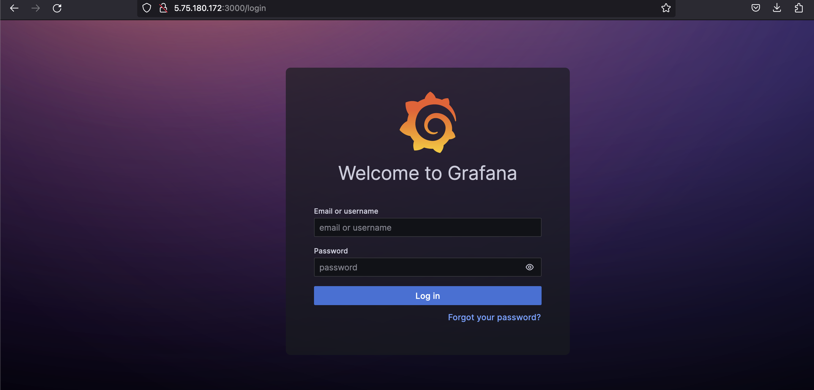
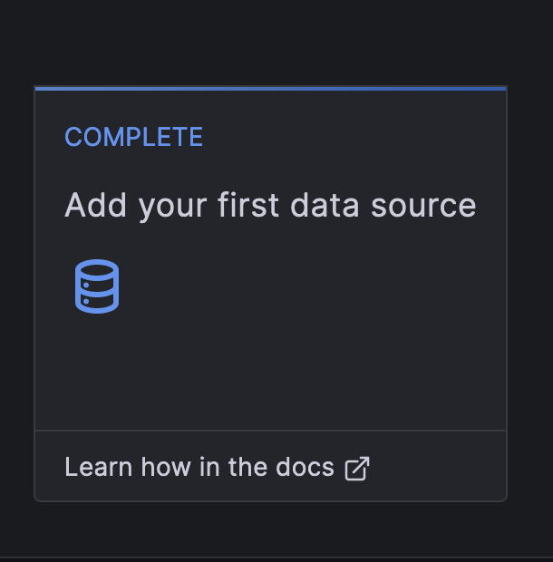
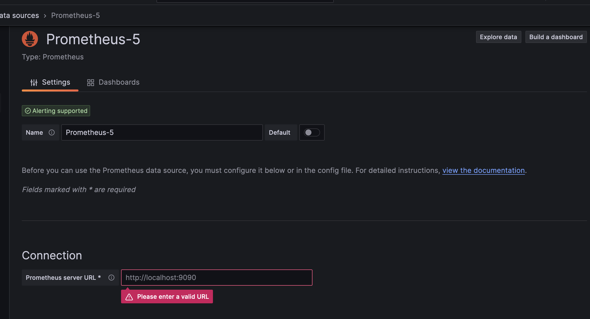
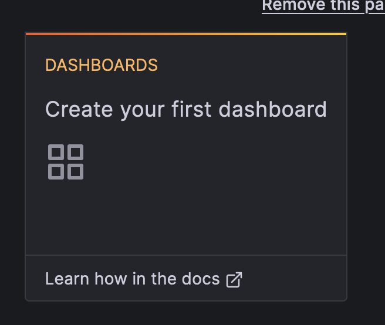
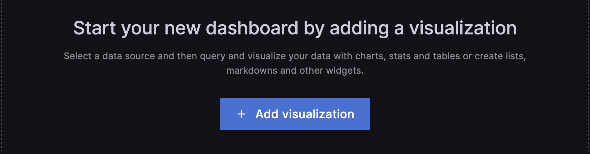
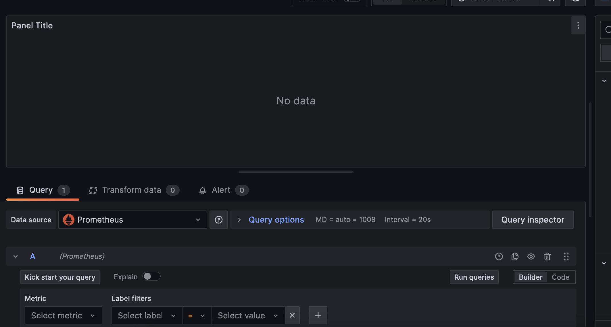
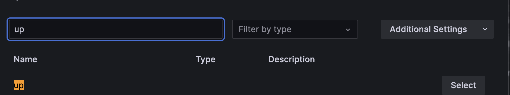
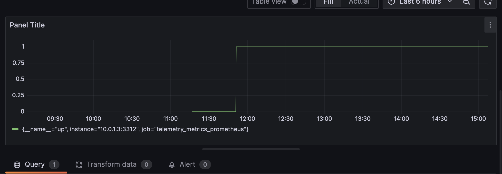

# General structure 

The enviroment consist of three virtual machines which contain the server, the explorer and a prometheus-grafana server. Each machine has its own private and public IP. when the VMs are created the public IPs are going to be printed in the terminal and we can use them to log into the VMs with 'ssh', the users for all the VMs is 'root'. Each VM has its own volume that uses to store the data and are all connected throught their private IPs which they use to read data from each other (in the case of the explorer and the prometheus-grafana instance).

# Commands 

there are three commands that we can execute:

* 'make terra-plan': it runs 'terraform plan' that checks that everything is ok and shows how the final infraestructure will look, it does not charge any fee since it does not create any virtual machine in hetzner.

* 'make terra-apply': it runs 'terraform apply'. When this command is executed the setup is created in the hetzner cloud. It creates three virtual machines which contain the server, the explorer and a prometheus-grafana instance.

* 'make terra-destroy': it runs 'terraform destroy' it will simply delete all the virtual machines instances and setup that we have in hetzner.

# Usage

In order to use the terraform setup you need to have a hetzner cloud token and set the variable in the 'terraform.tvfars' file. We also need to create a ssh key for hetzner and store in a 'tf_hetzner.pub' file inside the '.ssh/' directory. Once everything is setted run 'make terra-init' to initialize terraform then 'make terra-plan' to check the environment and finally 'make terra-apply' to execute it.

To create a valid ssh key, the following command can be used:
'ssh-keygen -f ~/.ssh/tf_hetzner -t rsa -b 4096 -N' 
it will generate the public and private keys required to log into the VMs

To generate a hetzner token we must have a hetzner account. then follow the next steps:
[https://docs.hetzner.com/cloud/api/getting-started/generating-api-token/]

# Grafana

Grafana and prometheus are tools used to analyze the metrics of the server and its health (similar to other tools like datadog) grafana provides a UI that you can use to check graphs and data in your browser. Once everything is setup and running in hetzner we can log into grafana using the IP direction that terraform prints in the terminal.

Steps to follow:
1) In your browser introduce the url http://[grafana-prometheus-ip]:3000. This will show the grafana's logging screen.
2) the default user and passwords for grafana is 'admin' it will offer the option to change it once logged, it can be skipped.

3) click in the option 'Add your first data source' and select prometheus in the screen that will appear.

4) It will ask for a url to connect, as prometheus and grafana are running in the same VM it can be setted as 'http://localhost:9090' then scroll down and select 'save & test'

5) Now you can create a dashboard from grafana main page, click on the option 'Dashboards' and then click the button 'Add visualization' and select the first option (the one that has 'default' icon). This will prompt grafana's query dashboars, from here the state of the server and other metrics can be scanned and checked in real time.

For example if we wanted to check if the server is running, we can select in the 'Metric' field of the query the metric explorer, that will list all the possible queries, we must selecte 'Up' and then click 'run queries'. It will generate the dashboard with the state of the server 

